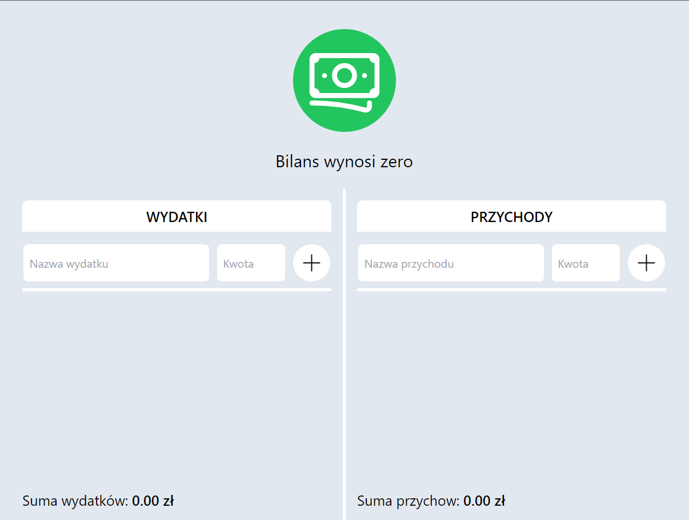
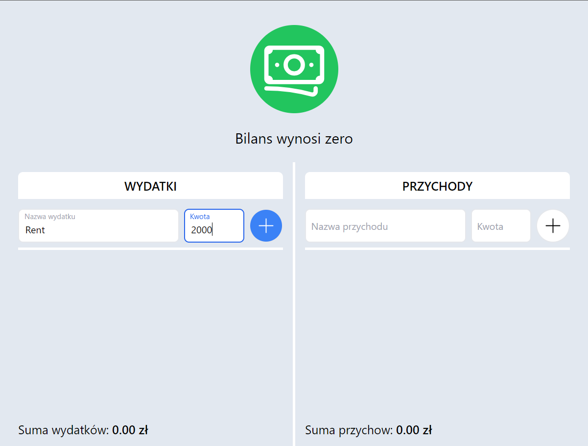
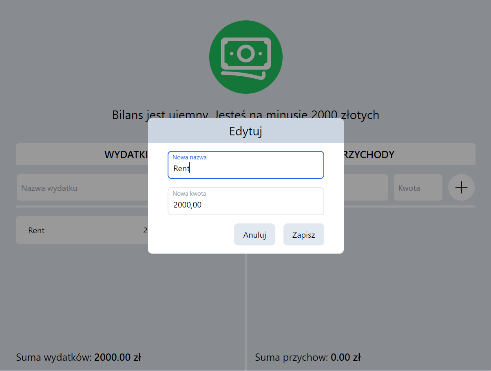
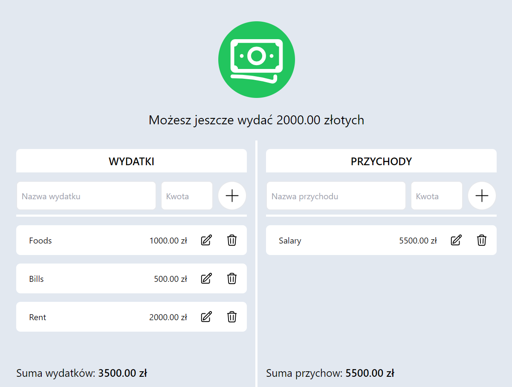
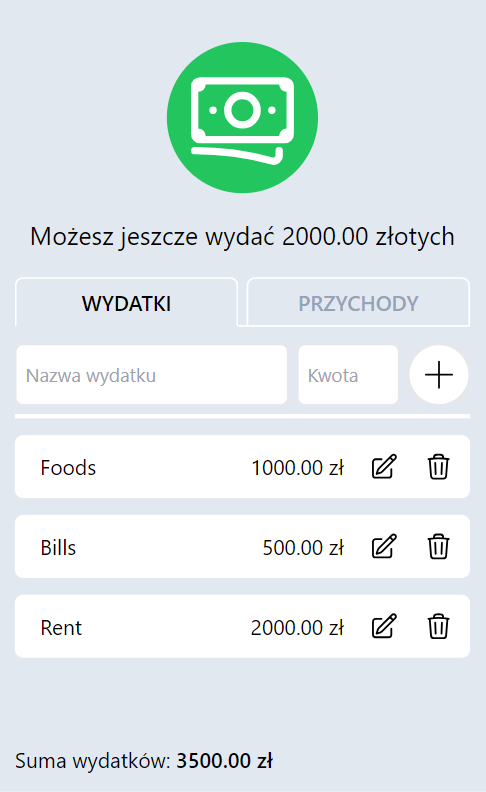

# Budget Calculator Web Application

Welcome to the **Budget Calculator**, a web application designed to help you manage your household finances effectively. This application allows you to keep track of your expenses and income, calculates the total amounts for both, and provides an overview of your remaining balance. Additionally, all your data is stored locally, ensuring that your financial information is preserved even if you reload the page.

## Features

### Expense and Income Tracking

- Add and categorize your expenses and income easily.
- Edit and delete entries as needed.

### Summaries and Totals

- Get real-time calculations for the total amounts of your expenses, total income, and remaining balance.
- Monitor your overall account balance.

### Data Persistence

- All your financial data is stored locally in the browser's memory.
- Your information is automatically restored upon reloading the page.

## Usage

1. **Adding Entries:**

   - Click on the "+" button to add a new expense or income entry.
   - Choose the category and enter the amount.

2. **Editing and Deleting:**

   - Hover over an entry to reveal options for editing or deleting.
   - Make necessary changes or remove entries that are no longer relevant.

3. **Viewing Summaries:**

   - Check the real-time summaries of your total expenses, total income, and remaining balance.

4. **Persistence:**
   - Your financial data is automatically saved locally.
   - Feel free to reload the page, and your information will be restored.

## Technologies Used

- **Frontend:**

  - HTML, CSS, JavaScript
  - React.js for the user interface

- **Data Storage:**
  - Local Storage for persisting data on the client side

### Deployed on Netlify

The application is deployed on Netlify and can be accessed through the following link:

### Application Screenshots

#### Home Page

#### Adding Transactions

#### Editing Entries

#### Overview of Summary Information

#### Mobile Version

# Getting Started with Create React App

This project was bootstrapped with [Create React App](https://github.com/facebook/create-react-app).

## Available Scripts

In the project directory, you can run:

### `npm start`

Runs the app in the development mode.\
Open [http://localhost:3000](http://localhost:3000) to view it in your browser.

The page will reload when you make changes.\
You may also see any lint errors in the console.

### `npm test`

Launches the test runner in the interactive watch mode.\
See the section about [running tests](https://facebook.github.io/create-react-app/docs/running-tests) for more information.

### `npm run build`

Builds the app for production to the `build` folder.\
It correctly bundles React in production mode and optimizes the build for the best performance.

The build is minified and the filenames include the hashes.\
Your app is ready to be deployed!

See the section about [deployment](https://facebook.github.io/create-react-app/docs/deployment) for more information.

### `npm run eject`

**Note: this is a one-way operation. Once you `eject`, you can't go back!**

If you aren't satisfied with the build tool and configuration choices, you can `eject` at any time. This command will remove the single build dependency from your project.

Instead, it will copy all the configuration files and the transitive dependencies (webpack, Babel, ESLint, etc) right into your project so you have full control over them. All of the commands except `eject` will still work, but they will point to the copied scripts so you can tweak them. At this point you're on your own.

You don't have to ever use `eject`. The curated feature set is suitable for small and middle deployments, and you shouldn't feel obligated to use this feature. However we understand that this tool wouldn't be useful if you couldn't customize it when you are ready for it.

## Learn More

You can learn more in the [Create React App documentation](https://facebook.github.io/create-react-app/docs/getting-started).

To learn React, check out the [React documentation](https://reactjs.org/).

### Code Splitting

This section has moved here: [https://facebook.github.io/create-react-app/docs/code-splitting](https://facebook.github.io/create-react-app/docs/code-splitting)

### Analyzing the Bundle Size

This section has moved here: [https://facebook.github.io/create-react-app/docs/analyzing-the-bundle-size](https://facebook.github.io/create-react-app/docs/analyzing-the-bundle-size)

### Making a Progressive Web App

This section has moved here: [https://facebook.github.io/create-react-app/docs/making-a-progressive-web-app](https://facebook.github.io/create-react-app/docs/making-a-progressive-web-app)

### Advanced Configuration

This section has moved here: [https://facebook.github.io/create-react-app/docs/advanced-configuration](https://facebook.github.io/create-react-app/docs/advanced-configuration)

### Deployment

This section has moved here: [https://facebook.github.io/create-react-app/docs/deployment](https://facebook.github.io/create-react-app/docs/deployment)

### `npm run build` fails to minify

This section has moved here: [https://facebook.github.io/create-react-app/docs/troubleshooting#npm-run-build-fails-to-minify](https://facebook.github.io/create-react-app/docs/troubleshooting#npm-run-build-fails-to-minify)

## Contributing

Contributions are welcome! Feel free to open issues or submit pull requests to enhance the functionality or fix any bugs.

## License

This project is licensed under the [MIT License](LICENSE.md).
